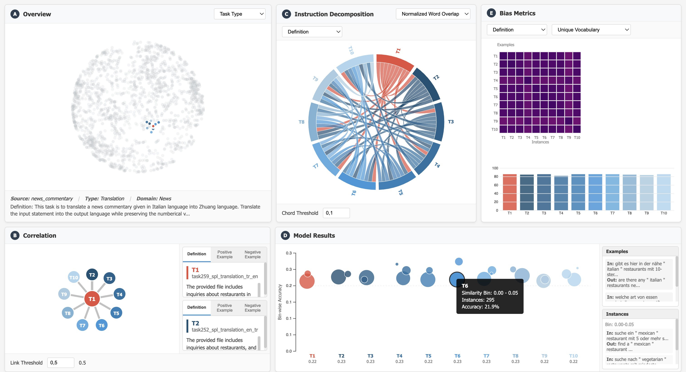

# LINGO: Visually Debiasing Natural Language Instructions

**Student**: Dhananjay Sharma  
**Matriculation Number**: 12230006  
**Course**: VU Visualisierung (193.166)   
**Semester**: Winter 2025/26

---
## Project Overview

This project reimplements the **LINGO visualization system** from the paper:

> Arunkumar, A., et al. (2023). "LINGO: Visually Debiasing Natural Language Instructions to Support Task Diversity." *Computer Graphics Forum (EuroVis 2023)*, 42(3), 409-421.

LINGO is an interactive visual analytics tool designed to identify and reduce bias in natural language task instructions used for evaluating large language models (LLMs). The system helps researchers understand how instruction wording affects model performance and task diversity.

---
## Features Implemented

This implementation includes all five interactive visualization panels from the original paper:

### **Panel A: Overview (3D Sphere Projection)**
- Displays 1,616+ NLP task instructions as interactive points on a rotatable 3D sphere
- Uses t-SNE dimensionality reduction for 3D coordinate generation
- Color-coded visualization:
  - **Before selection**: Colored by task category or source dataset
  - **After selection**: T1 (selected task) = RED, T2-T10 (similar tasks) = BLUE gradient, unrelated tasks = GREY
- Interactive rotation via mouse drag
- Depth-based opacity for realistic 3D effect

### **Panel B: Correlation (Node-Link Diagram)**
- Shows similarity network between selected task (T1) and its 9 most similar tasks (T2-T10)
- **Circular layout**: T1 positioned at center, similar tasks arranged in a circle
- **Distance-based positioning**: Higher similarity = closer to center
- **Link thickness**: Represents similarity strength (thicker = more similar)
- **Interactive comparison boxes**: Side-by-side task comparison with tabbed views
  - Definition tab
  - Positive Examples tab
  - Negative Examples tab
- Adjustable similarity threshold (0.5 - 0.95)

### **Panel C: Instruction Decomposition (Chord Diagram)**
- Visualizes word overlap between task instruction components
- **Selectable components**:
  - Task Definition
  - Positive Examples
  - Negative Examples
- Chord thickness represents overlap strength
- Adjustable threshold to filter low-overlap connections
- Color scheme: T1 = RED, T2-T10 = BLUE gradient

### **Panel D: Model Results (Beeswarm Plot)**
- Displays model accuracy on task instances grouped by similarity bins
- **X-axis**: Tasks T1-T10
- **Y-axis**: Bin-wise accuracy (0-1)
- **Point size**: Number of instances in each similarity bin
- **20 similarity bins**: Groups instances by similarity to instruction examples
- **Side panels**: Show examples and instances on hover
- Reveals instruction bias patterns (top-heavy distribution = high bias)

### **Panel E: Bias Metrics**
- **Heatmap**: Jaccard similarity matrix between task examples and instances
- **Bar Chart**: Unique vocabulary contribution per task
- **Three bias metrics**:
  - Jaccard Similarity - Adverbs (most important for bias detection)
  - Jaccard Similarity - Nouns
  - Unique Vocabulary
- **Selectable components**: Definition, Positive Examples, Negative Examples
- Helps identify which tasks have low linguistic diversity

---

## Tech Stack

### Backend
- **Python 3.8+**
- **Flask**: REST API server
- **Sentence-Transformers**: Generate sentence embeddings for task instructions
- **scikit-learn**: t-SNE for 3D dimensionality reduction
- **NLTK**: Text preprocessing, tokenization, POS tagging
- **NumPy & Pandas**: Data processing and numerical operations

### Frontend
- **HTML5, CSS3, JavaScript (ES5)**
- **D3.js v7**: All interactive visualizations
- Responsive flexbox layout
- No external UI frameworks (pure D3.js implementation)

### Dataset
- **SUP-NATINST** (Super-Natural Instructions)
- **Source**: GitHub repository (big-science-workshop/lm-evaluation-harness)
- **Size**: 1,616 NLP tasks with complete instruction schemas
- **Coverage**: 76 task categories, 55 languages (576 non-English tasks)
- Each task includes:
  - Task definition
  - Positive examples (with explanations)
  - Negative examples (with explanations)
  - Task instances for evaluation

## Data Setup

**Note**: Due to size constraints (3.3GB raw, 800MB processed), data files are NOT included in this repository.

### Getting the Data

1. **Download the dataset**:
   - Download SUP-NATINST from: https://github.com/allenai/natural-instructions/archive/refs/heads/master.zip
   - We only need tasks folder as it contains the data
   - Place in `data/` directory

2. **Run the processing scripts**:
```bash
   python scripts/process_data.py
   python scripts/comute_tsne.py
   python scripts/comute_metrics.py
   python scripts/comute_similarities.py
   python scripts/create_final_data.py
   python scripts/generate_embeddings.py
```
   This will generate all necessary processed data files (~800MB)

   - Run all the scripts in the scripts as they required for running visualization panels

3. **Start the application**:
```bash
   python app.py
```

## Usage Guide

### Selecting a Task

1. **Panel A (Overview)**: Click any point on the 3D sphere to select a task
2. The selected task (T1) turns RED
3. The 9 most similar tasks (T2-T10) appear in BLUE gradient
4. All other tasks turn GREY
5. You can rotate the sphere by clicking and dragging

### Exploring Task Similarity

1. **Panel B (Correlation)**: View the network diagram
   - T1 is at the center
   - Similar tasks arranged in a circle (closer = more similar)
   - Click nodes or links to compare tasks
   - Use the comparison boxes to view definitions and examples
   - Adjust the "Link Threshold" to filter connections

### Analyzing Instruction Components

1. **Panel C (Chord Diagram)**: 
   - Select component: Definition, Positive Examples, or Negative Examples
   - Thicker chords = higher word overlap
   - Adjust "Chord Threshold" to filter weak connections
   - Click chords to compare tasks in Panel B

### Viewing Model Performance

1. **Panel D (Beeswarm)**: 
   - Each column represents a task (T1-T10)
   - Vertical position = accuracy
   - Point size = number of instances in that similarity bin
   - Hover over points to see examples and instances
   - Top-heavy distribution = high bias (model memorizing examples)

### Identifying Bias

1. **Panel E (Bias Metrics)**:
   - **Jaccard Similarity - Adverbs**: Most important metric
     - High similarity (dark colors) = LOW diversity = BIAS
     - Adverbs indicate text complexity
   - **Unique Vocabulary**: Higher values = more diversity
   - Select different components to analyze different parts of instructions

---

## Key Implementation Details

### 3D Sphere Projection

- Task instructions converted to 512-dimensional embeddings using Sentence-Transformers
- t-SNE reduces to 3D coordinates while preserving local structure
- Points normalized to unit sphere surface
- Orthographic projection for 2D rendering
- Interactive rotation using D3.js drag behavior

### Similarity Calculation

- **Cosine similarity** between sentence embeddings for task-to-task similarity
- **Jaccard similarity** for component-level word overlap
- Threshold-based filtering to show only meaningful connections

### Bias Metrics Implementation

- **Jaccard Similarity (Adverbs)**: Extracts adverbs using pattern matching (words ending in "-ly" + common adverbs list)
- **Jaccard Similarity (Nouns)**: Filters out verbs and adverbs using common word lists
- **Unique Vocabulary**: Counts unique words (length > 2) in instruction components
- Simplified POS tagging (no external NLP library for performance)

---

## Known Limitations

1. **Synthetic Model Results**: Uses randomly generated accuracy scores (GPT-3 API access not available for this project)
2. **Simplified POS Tagging**: Uses heuristic-based approach instead of proper NLP library (spaCy/NLTK taggers)
3. **No Real-time Instruction Modification**: Original LINGO paper includes live instruction editing with model re-evaluation

## Screenshot

### Full Dashboard


## References

### Original Paper
Arunkumar, A., Sharma, S., Agrawal, R., Chandrasekaran, S., & Bryan, C. (2023). LINGO: Visually Debiasing Natural Language Instructions to Support Task Diversity. *Computer Graphics Forum*, 42(3), 409-421.

### Dataset
Wang, Y., Mishra, S., Alipoormolabashi, P., Kordi, Y., Mirzaei, A., et al. (2022). Super-NaturalInstructions: Generalization via Declarative Instructions on 1600+ NLP Tasks. *EMNLP 2022*.

### Libraries & Tools
- D3.js Documentation: https://d3js.org/
- Flask Documentation: https://flask.palletsprojects.com/
- Sentence-Transformers: https://www.sbert.net/
- scikit-learn: https://scikit-learn.org/